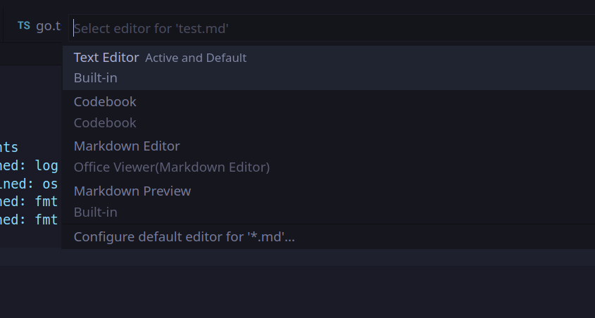

# Codebook 
## Quick Start
- Open or create a `.md` document
- Right-click the filename and select `Open With` or `Reopen Editor With...`
- Select `Codebook`
- Add a cell
- Chose your language in the bottom right
- Run the code and save the document
- The output is now saved to standard Markdown
- Upload to Github to see outputs rendered as you would expect

__Important Note__
When you right-click on a file and select `Reopen Editor With...` you can `configure default editor` to be the standard `Text Editor` if you choose, and then only open `Codebook` when you need it:


## Description
Straight nodejs stateless implementation for notebooks with no npm dependencies or external binaries, works with compiled languages.

Rather than using any complicated kernels, it simply spawns a process that runs your local toolchain for the language you're using and returns outputs for all previous cells using the current cell's language.

## Keybindings
You can change keybindings in File > Preferences > Keybindings > search for "codebook". Or you can run them via command palette typing in "codebook"

### Search Notes
Press `alt+f` to open a welcome document and get started, `alt+f` will also open search in the `base path` (defaults to `~/codebook`) which can be changed in settings: File > Preferences > Settings > search for "codebook". Any notes you keep in here will be searchable from any repository by pressing `alt+f`.

### Open Generated Code
Press `alt+o` to open up the source code being used to generate outputs, which will allow you to check your code with a language server if it's not supported in the cells yet.

## Language Support
It's very simple to add your own language, look inside [src/languages/rust.ts](https://github.com/jackos/codebook/blob/main/src/languages/rust.ts) for an example, then add your language to the switch statement in [`src/kernel.ts`](https://github.com/jackos/codebook/blob/main/src/kernel.ts). Please open a pull request if you add a language, it's a lot easier than you might expect and it will be appreciated.

### Rust       
- [x] Use external code:
```rust
use rand::Rng;
```

- [x] Debug final expression:
```rust
let x = vec![1, 2, 3];
x
```
```output
[1, 2, 3]
```

Or you can pretty debug by putting a `#` on the front:
```rust
let x = vec![1, 2, 3];
#x
```
```output
[
    1,
    2,
    3,
]
```

- [ ] Language Server Support

`Rust-analyzer` does work by hacking with line numbers and ranges on the server end, but it's not reliable enough to release yet, many things break when creating or moving cells.


### Go         
- [x] Import External Code
- [ ] Language Server Support

### Javascript 
- [ ] Import External Code
- [x] Language Server Support

### Typescript 
- [ ] Import External Code
- [x] Language Server Support

## Inspiration
- Vimwiki
- Jupyter Notebook
- [This comment](https://news.ycombinator.com/item?id=11042400)


